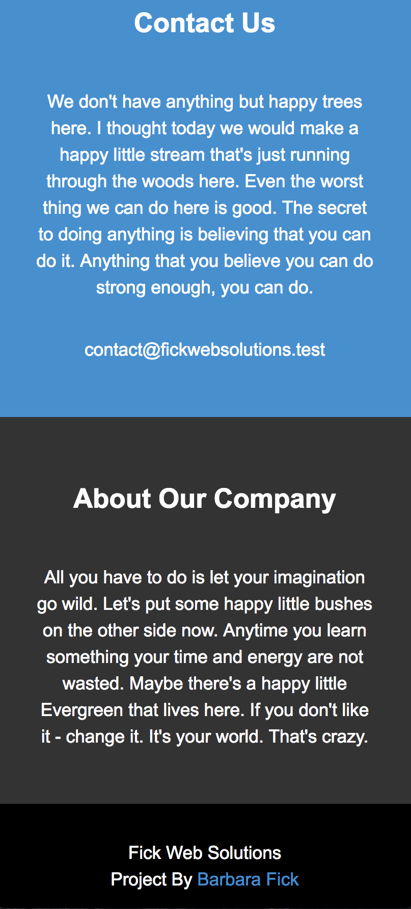
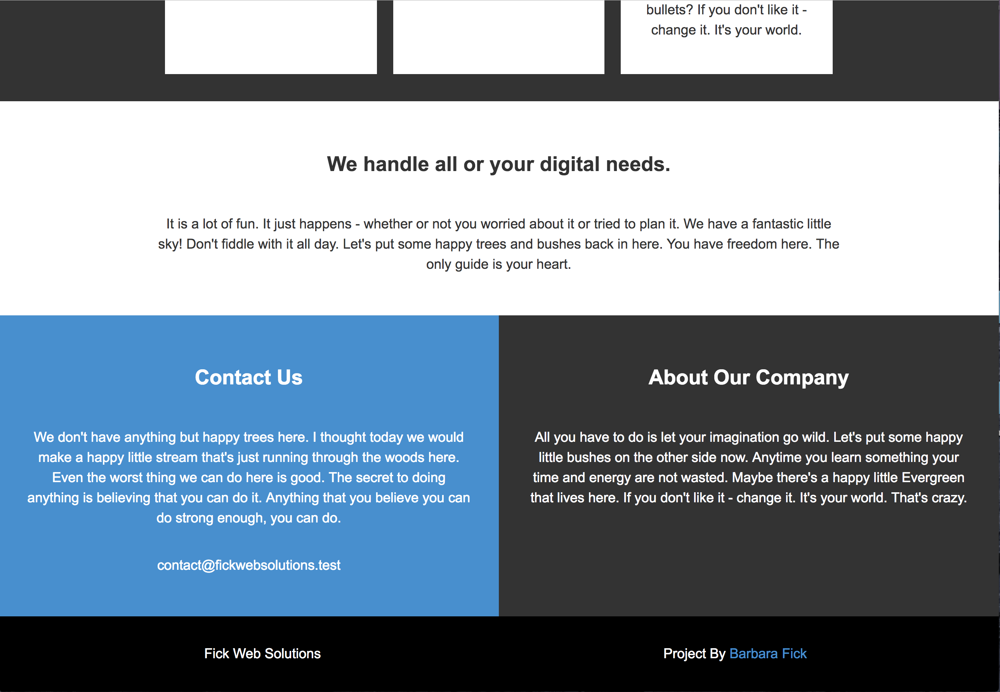

# Grid Layout

##Overview
Practicing the basics of grid layout and a basic mobile first responsive layout page.  Added in media query for 700px min-width.
   
## Live Site
- https://bnkfick.github.io/Grid-Layout/index.html
- https://bnkfick.github.io/Grid-Layout/index1.html
- https://bnkfick.github.io/Grid-Layout/index2.html
- https://bnkfick.github.io/Grid-Layout/index3.html
- https://bnkfick.github.io/Grid-Layout/index4.html

